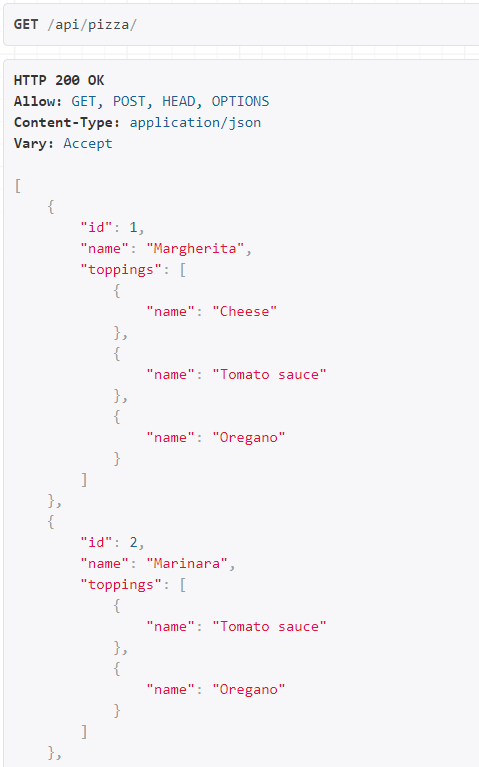
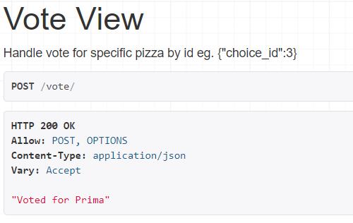
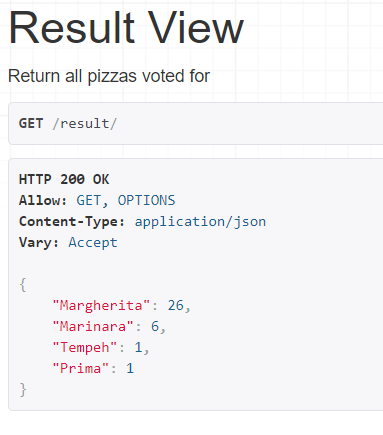

Pizza Vote api
=============

Application for voting for the best pizza.

### Note
    Voting is available for all users
### Prerequisites
    Python==3.8.0
    Django==3.0.3
    djangorestframework==3.11.0
### Installing
    git clone https://github.com/Pafelll/django_pizza_vote
    install prerequisites    

### Endpoints
    GET /api/pizza/ request to retrieve all available pizzas with toppings

   
    POST /vote/ request for voting

    GET /result/ request to retrieve current votes

